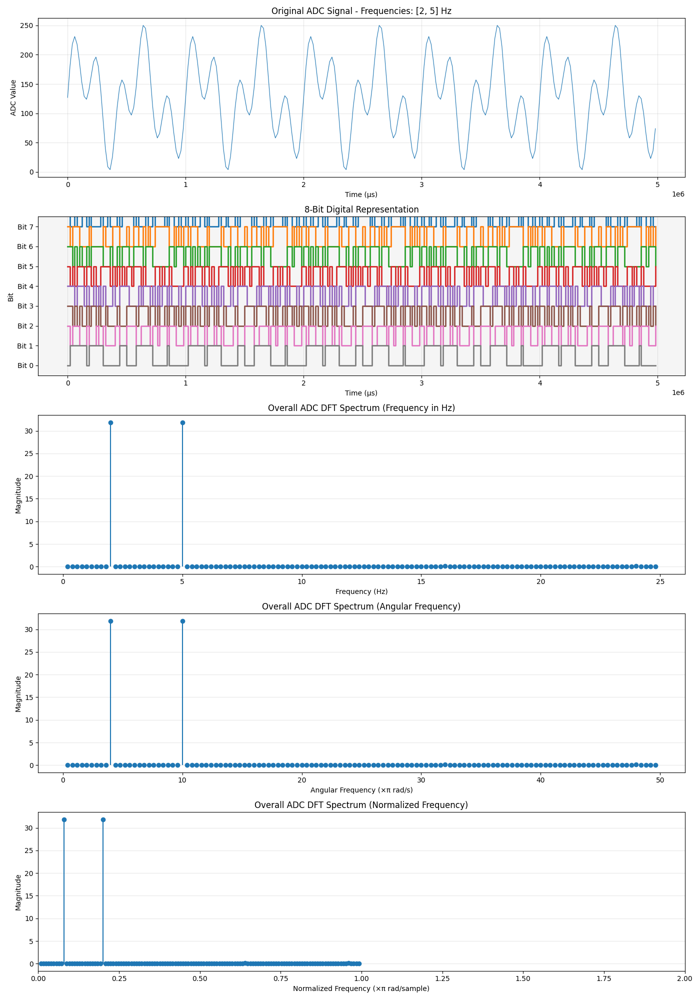

# ADC DFT Proof of Concept

This script is a simulation and analysis tool for understanding the behavior of an Analog-to-Digital Converter (ADC) and the frequency components of its output. It is particularly useful for visualizing how a digitized signal and its individual bits behave in the frequency domain.

The simulation generates a composite analog signal, quantizes it as an ADC would, and then performs a Discrete Fourier Transform (DFT) to analyze its frequency spectrum.

## Key Features

- **Multi-frequency Signal Generation**: Create a complex analog signal by combining multiple sine waves with adjustable weights and frequencies.
- **ADC Simulation**: Simulate the quantization process of an ADC with a configurable resolution (e.g., 8-bit, 12-bit).
- **Noise Simulation**: Add Gaussian noise to the analog signal to study its effect on the ADC output and frequency spectrum.
- **Binary Visualization**: View the time-domain waveform of each individual bit of the ADC output, showing how the digital bits toggle over time.
- **DFT Analysis**: Compute the frequency spectrum of both the full ADC signal and each individual bit stream. This helps in understanding how different frequencies are represented in the digital domain.
- **Comprehensive Plots**: The script generates and saves detailed plots for a complete analysis.

## System Diagram


## How to Run

To run the simulation, simply execute the script from your terminal:

```bash
python adc_dft_poc.py
```

## Configuration

You can customize the simulation by editing the parameters in the `if __name__ == "__main__":` section of the `adc_dft_poc.py` file.

```python
if __name__ == "__main__":
    # --- Simulation Parameters ---

    # Define the frequencies (in Hz) and their relative weights (amplitudes).
    frequencies = {2: 0.5, 5: 0.5}

    # Generate the ADC signal.
    samples, times = generate_adc_signal(
        frequencies_dict=frequencies,
        duration_periods=10,  # Number of periods of the lowest frequency to generate.
        noise_level=0         # Standard deviation of Gaussian noise (0-1).
    )
    
    # ... rest of the script
```

### Main Parameters

- `ADC_RESOLUTION`: The resolution of the ADC in bits (e.g., `8` for an 8-bit ADC).
- `ADC_SAMPLING_RATE`: The sampling frequency of the ADC in Hz.
- `frequencies`: A Python dictionary defining the input signal.
    - **Keys**: The frequency of each sine wave component in Hz.
    - **Values**: The weight (amplitude) of each frequency component.
- `duration_periods`: The total duration of the signal, specified as a number of periods of the lowest frequency in the `frequencies` dictionary.
- `noise_level`: The standard deviation of Gaussian noise to add to the analog signal before quantization. A value of `0` means no noise.

## Output Analysis

The script produces two main output figures, which are displayed on the screen and also saved as PNG files in the project directory.

### Figure 1: `figure1_analysis.png`

This figure provides an overall analysis of the ADC signal.

1.  **Original ADC Signal**: A plot of the quantized ADC values over time. This shows the final digital waveform.
2.  **Digital Bit Representation**: A plot showing the state (0 or 1) of each individual bit of the ADC over time. This is useful for visualizing how the bits toggle in response to the analog signal.
3.  **Overall ADC DFT Spectrum**: A frequency spectrum plot of the complete ADC signal. This shows the main frequency components present in the digitized signal.



### Figure 2: `figure2_bit_dfts.png`

This figure provides a DFT analysis for each individual bit stream of the ADC output. For an 8-bit ADC, it will contain 8 separate plots (from Bit 0 to Bit 7).

Each plot shows the frequency spectrum of a single bit's digital stream. This is a powerful tool for understanding which frequencies have the most significant impact on each bit. For example, you might find that lower-frequency components are more prominent in the most significant bits (MSBs), while higher-frequency components affect the least significant bits (LSBs).

