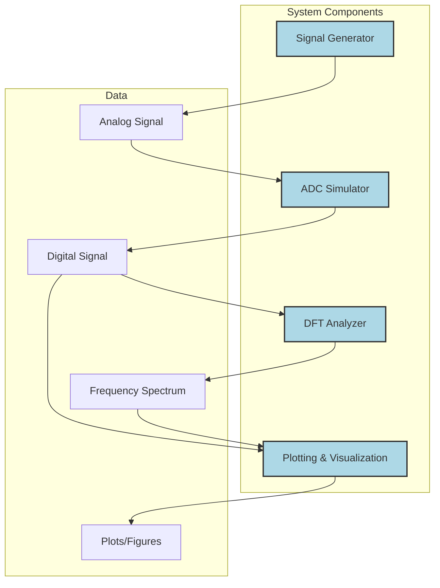

```mermaid
graph TD
    subgraph "System Components"
        A[Signal Generator]
        B[ADC Simulator]
        C[DFT Analyzer]
        D[Plotting & Visualization]
    end

    subgraph "Data"
        E[Analog Signal]
        F[Digital Signal]
        G[Frequency Spectrum]
        H[Plots/Figures]
    end

    A --> E;
    E --> B;
    B --> F;
    F --> C;
    C --> G;
    F --> D;
    G --> D;
    D --> H;

    style A fill:#add8e6,stroke:#333,stroke-width:2px
    style B fill:#add8e6,stroke:#333,stroke-width:2px
    style C fill:#add8e6,stroke:#333,stroke-width:2px
    style D fill:#add8e6,stroke:#333,stroke-width:2px
```